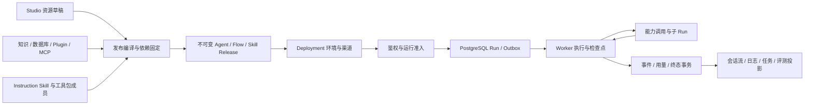

# BetterYeah 浏览器实证与架构差距

本次使用用户已登录的 Chrome，沿真实页面逐项查看 Agent、Skill、Flow、知识库、数据库、MCP、发布、日志、效果观测、设置和对话。结论是：本项目已有真实产品与持久化基础，但尚未完整还原参考产品。尤其不能把 G1 内核能力、后台子 Agent 或仅有指令文本的 Skill Pack，分别当作产品的完整运行系统、任务中心或工具包。

## 证据与实验环境

| 项目 | 本次记录 |
|---|---|
| 采集时间 | 2026-09-13，Asia/Shanghai；MCP 草稿列表回显创建时间 19:27 |
| 参考入口 | [BetterYeah Agent](https://ai.betteryeah.com/agent) |
| 客户端 | 用户现有 Chrome 登录会话；使用页面导航、可访问性树与关键页面截图 |
| Workspace | 已有自建 Workspace，试用版已过期；身份来自现有登录会话，未另建用户 |
| 产品版本 | 前端未提供可核对的 build/release 标识；未知，不能用采集日期替代版本号 |
| 已有资源 | 查看既有 Agent、已发布 Skill、已发布 Flow 和文档知识库；不将其内容写入本项目 |
| 模型配置 | 查看 Agent 的 moonshot-v1-128k 和 Flow 的 gpt-4o-mini 配置；未新执行模型请求 |
| 源码基线 | 本仓库开始时 HEAD 为 ce1caa9，工作区干净；以下 C 级结论基于代码审计 |
| 产品侧副作用 | 点击 MCP“创建”立即生成“未命名MCP1”空草稿；返回列表确认为未发布、0 个工具。未发布、未绑定资源；为保留用户数据未执行删除 |
| 未采集 | API Key、Cookie、用户电话、业务文件内容不写入研究资产；未取得私有后端源码或数据库拓扑 |

证据分级：**B** 为浏览器实际状态；**O** 为官方文档；**C** 为本项目代码；**D** 为本项目自定设计；**U** 为仍未知。B/O 证明产品可见行为，不证明数据库、队列、模型路由或服务拆分。可访问性树中的隐藏表单也不能直接升级为可操作功能。

本次参考产品的账户条件不足以完成运行、故障注入、依赖撤销和企业版观测实验。它们继续属于 [R-A1～R-A12](../08-待补信息.md)，不能因为导航已覆盖就标记通过。

## 浏览器路径台账

以下路径中的资源 ID 使用占位符；从列表选择记录可复查。无需泄露用户标识或业务内容。

| ID | 路径与操作 | 已观察事实 B | 本次未验证 U |
|---|---|---|---|
| B01 | `/agent` | 本空间/A2A 两种列表；关注、最近编辑、创建人、分组、标签；列含模型、引用资源和关联应用 | 分组/标签的权限范围，A2A 注册载荷 |
| B02 | `/agent/<agent>/design/rule` | 自由模式、角色设定、模型、开场白、引导问题、推荐提问、权限变量、Mock、变量、强制调用、预设任务、快捷入口、隐藏技能图示、异常自动重试 | 权重的执行算法；Mock 是否进入发布；重试错误分类、次数与退避 |
| B03 | `/agent/<agent>/design/multiagent` | 本空间/A2A 服务切换；每个绑定有描述、权重和启用开关 | 上下文传递、深度/并发上限、父取消、预算和失败聚合 |
| B04 | `/agent/<agent>/design/skill` | 已有 Skill 绑定和启用开关；添加抽屉及新建 Skill 服务入口 | 保存 JSON、版本解析、工具调用 trace |
| B05 | `/skill` → 已发布项 → `/skill/<skill>/edit` | 已发布状态与工具数量；工具有引用资源、描述、输入字段；包有独立描述和说明 | 发布是否创建不可变版本；编辑是否影响已绑定 Agent |
| B06 | Skill 编辑器“添加工具” | 来源菜单为插件、工作流；一个现有工具输入为必填 `urls: String`；包描述显示 500 字计数，说明编辑器标识为 `skill_md` | 500 字的后端校验；工具参数映射、默认值和失败传播 |
| B07 | `/application` → 已发布工作流编辑器 | 画布为开始→LLM→输出；开始可选表单/Webhook；LLM 有模型、提示词、上下文来源与文本/JSON输出；工具栏含运行、批量调试、多环境、发布 | 执行输出、流式协议、版本隔离；未切换多环境 |
| B08 | Flow 左上节点库 | LLM、文档/问答、多模态知识、数据库、Python、JavaScript、批处理、逻辑分支、循环、文本、意图分类、图文分类、API；另有模板、插件、子工作流 | 各节点 Schema/错误码、沙箱实现、循环恢复和副作用幂等 |
| B09 | Flow 节点库插件区 | 可见企业文档/表格、网页/文档/音视频解析、图像、搜索、社交内容和图表工具分类 | 目录是否穷尽全部权益与版本；未执行第三方写操作 |
| B10 | `/datastores` | 文档、问答、多模态三种创建入口；容量按视频与其他知识分开；资源有文档数、关联应用 | 摄取/更新事务、多模态模型及文件权限传播 |
| B11 | `/datastores/<workspace>/<store>/documents` | 文档、近义词库、命中测试；文档有段落/字符数、状态及启用开关 | 删除/恢复、索引代际与版本 pin |
| B12 | 知识库命中测试 → 查询设置 | 语义、关键词、全文独立开关；结果重排、最低相似度、最大结果数。当前选中阈值 0.4、最大结果数 6 | 6 是当前配置，不能写成平台默认；融合权重及排序模型未知 |
| B13 | `/db` → 新建数据库 | 当前无数据库；创建表单名称/描述分别显示 50/200 字计数，同时出现权益窗口 | 表头类型、行级读写、SQL 返回结构未取得；未提交创建 |
| B14 | `/mcp` → 创建 → 添加工具 → 返回列表 | 创建立即保存空草稿，发布禁用；工具来源为插件、工作流、知识库；列表区分未发布和工具数 | 已发布 Endpoint、鉴权头、工具发现与调用协议；未发布测试草稿 |
| B15 | `/agent/<agent>/agentgo` | 网页、对话、API、SDK、A2A 和多个企业/微信渠道；网页可选授权访问或公开访问，当前是授权访问 | 发布版本与渠道配置生效时机、访问撤销、Webhook重试；未修改权限 |
| B16 | `/agent/<agent>/log` | 日志/反馈、日期与状态筛选；列含积分、运行方式、客户端、首字响应和时长。运行方式区分调试/多模型对比/批量测试与线上 Chatbot/Agent/API/子Agent/A2A/copilot | 时间区间为空不等于无历史运行；积分列不证明成本结算算法 |
| B17 | `/agent/<agent>/monitor/effect` | 指标监控、在线质检、批量测评、评估器四个入口；监控支持简易说明或工作流高级编排 | 自动采样、评分算法、保留策略、告警与Run关联 |
| B18 | `/agent/<agent>/monitor/inspector` → 创建 | 明确提示当前版本不支持，需要企业版 | 企业功能执行不可测，不推断为“不存在” |
| B19 | `/workspace/<workspace>/settings/overview` | 概览、告警、用户、订单、数据源、开发配置；工作空间配额与身份配置分开 | 多角色权限矩阵、API Key scope/撤销；未复制或留存凭据值 |
| B20 | `/chatbot/<agent>` | 会话历史、新会话、推荐提问、输入附件/语音入口、Agent/技能说明。AX 树含任务区与创建字段 | 本次任务表单未能在截图中确认可见操作，下拉交互失败；不把AX字段当完整任务创建实证 |
| B21 | [本项目 Studio](https://songuu.top/better-agent/) | 现有 Chrome 页面显示七个产品导航与 `BUILD · CE1CAA98`；当前提示登录后加载 | 仅验证当前页面呈现，不证明服务端revision、运行、重启、回滚或本轮代码部署 |

本次未完成 A2A 远端接入、全部官方插件执行、完整角色规则保存、每种知识摄取、数据库字段类型、所有发布渠道及调度实验；不宣称“全站所有功能已摸透”。

## 官方资料补证

| 来源 | 可支持的结论 O | 不能据此推断 |
|---|---|---|
| [2026-03-05 更新](https://ai-docs.betteryeah.com/更新日志/2026-03-05%20更新日志.html) | Skill 可组合工作流/插件，配置说明后发布，供 Agent 使用 | 依赖不可变性、撤销/恢复、内部协议 |
| [文档知识处理](https://ai-docs.betteryeah.com/知识库/文档知识处理.html) | 自动分段与自定义分段有区别；500 字不能泛化成所有场景硬上限 | 本项目当前全文检索已等价于多路检索 |
| [数据库调用](https://ai-docs.betteryeah.com/数据库/调用数据库.html) | Flow 数据库包含增删改查与查询限制 | Agent 写入授权/确认与跨调用事务 |
| [2025-12-18 更新](https://ai-docs.betteryeah.com/更新日志/2025-12-18%20更新日志.html) | 知识历史版本与恢复是产品能力 | Agent/知识/Flow 共用同一种版本解析方式 |
| [2026-01-29 更新](https://ai-docs.betteryeah.com/更新日志/2026-01-29%20更新日志.html) | 复制可保留资源关联；子工作流发布有环境选择 | 老会话自动跟随新依赖 |
| [创建 MCP](https://ai-docs.betteryeah.com/MCP服务/创建MCP服务.html) | MCP 可包装平台工具提供对外服务 | 仅实现外部 MCP client 已覆盖 MCP 产品面 |
| [2025-07-03 更新](https://ai-docs.betteryeah.com/更新日志/2025-07-03%20更新日志.html) | A2A 有本地发布及外部 Agent 连接方向 | 任意远端输出或身份可以成为本地授权 |

## 从产品行为导出的领域边界

下面是本项目的 D 级设计，不是 BetterYeah 私有实现的复原图。

需要保留的区别：

1. Agent 是行为入口，Flow 是显式执行图；Skill 包是说明和精确工具成员的发布装配。Instruction Skill 只是其中的指令资源，不能替代可调用成员。
2. MCP client 接入外部工具，与 MCP server 导出本地工具是两个方向；A2A 远端 Agent 也不能退化成未经授权的任意 HTTP 请求。
3. Draft 自动保存、Release 发布、Deployment 渠道可见性是不同事务。页面有“已保存”和“发布”只证明 UI 区分，不能推出其后端 pin 语义。
4. 任务模板、调度计划、单次运行和通知投递分别持久化。运行超时/取消、调度取消和通知重试不可共用一个布尔字段。
5. 日志、在线质检与统计都是运行事实的投影；评估器运行也需要固定输入与版本，不能反向授予生产执行权限。

## 当前代码与完整产品之间的差距

| 能力 | 当前 C 级依据 | 必须补齐的产品闭环 |
|---|---|---|
| 父运行 | `apps/web/src/server.ts` 在 HTTP handler 内创建、执行、等待 child 和完成 Run；页面等待 POST 回答 | 接受请求后可脱离 HTTP 的持久执行；取消、重启恢复、逐事件流和重连 |
| G1 内核 | `apps/api`、`run-core` 已有准入、SSE、HumanGate 等组合边界，但 `apps/api` 不是已启动的产品服务 | Product adapter 接入同一权限/执行/事件事实，禁止把库测试当产品可用 |
| SubAgent | 044/045 递归/并行；046 持久 child job 和 worker | 父任务恢复、任务管理、取消传播的完整 UI/API；本轮只修 worker 失权继续执行 |
| Skill | 039 与 `ProductSkillPackInput` 保存描述/指令；`withSkillPackInstructions` 注入说明 | 真实工具成员、精确版本、参数契约、运行选择与逐工具收据 |
| Flow | `flow-runtime.ts` 当前八类受控节点 | 真实 LLM 节点、分支执行图、循环/批处理、代码沙箱及每类节点的失败/恢复 |
| Knowledge | 文本切块与 PostgreSQL 全文检索 | 文件解析、多模态、异步摄取、索引代际、语义/关键词/全文融合、重排与ACL |
| Database | 表/行 CAS 与受控查询 Operation，固定历史数据 | 安全写 Operation、参数Schema、写入确认、事务与回滚；不可直接开放模型任意SQL |
| 身份 | 单个配置 Workspace/Actor 与管理密码 | 用户/成员/角色、Workspace 切换、资源共享和渠道身份授权 |
| 发布 | Agent 不可变版本；Flow 环境部署与回滚已有资产 | Agent Deployment/API key/SDK/Webhook、可撤销浏览器访问、MCP/A2A 导出 |
| 观测 | Run Console、token与部分发布评测 | 反馈、在线质检、评估器、监控、告警、运营统计与可核对成本 |

代码审计入口：[`server.ts`](../../apps/web/src/server.ts)、[`product-store.ts`](../../apps/web/src/product-store.ts)、[`flow-runtime.ts`](../../apps/web/src/flow-runtime.ts)、[`knowledge-runtime.ts`](../../apps/web/src/knowledge-runtime.ts)、[`worker-runtime.ts`](../../apps/worker/src/worker-runtime.ts)、[迁移目录](../../packages/db/migrations)、[门禁清单](../../tests/architecture-gate/manifest.json)。

实施顺序、依赖、owner 与失败验收见 [架构收敛实施计划](../plans/2026-09-13-product-architecture-convergence.md)。本文件不把任何目标设计记作已实现，也不新增生产验收结论。

## 本轮实现与验证记录

源码对象为本次未提交工作区；未 commit、push 或部署。S0 修改共享模型接口、递归/并行执行、Worker 和 PostgreSQL store 错误分类，共八个源/测试文件；另同步两个门禁库存文件。Agent Runtime 测试从 9 增至 15，Worker 从 10 增至 25，共新增 21 个回归用例。

| 检查 | 结果 | 证据边界 |
|---|---|---|
| `pnpm check` | 最终修复后 exit 0；format/lint、workspace、contract、typecheck、test、build 全通过 | 使用仓库正常 Turbo 缓存；包含15个包，不含真实PG和公网产品验收 |
| Agent Runtime | 15/15 通过，类型检查/构建通过 | 取消传递、递归边界、Responses 请求和响应体取消；受控模型夹具 |
| Worker | 25/25 通过，类型检查/构建通过 | 精确失权、存储错误、迟到模型、输出超限、并发写入首错/迟错、永不返回写入、清理超时与计时器回收 |
| Web | 144/144 通过，类型检查通过 | 确认共享模型接口变更兼容既有产品HTTP测试；不是生产模型成功证据 |
| `pnpm architecture:gate:test` | 37/37 通过 | 架构门禁自身测试；不等于完整 `architecture:gate` 聚合通过 |
| 代码审查 | code-reviewer、typescript-reviewer 最终无新增finding | 输出格式化误分类、并发错误掩盖及无界清理三个问题已修复并补回归 |
| 文档审查 | 修正资源版本/hash契约与部署事实措辞；审查时100个本地链接目标存在 | 研究事实与设计分开；后补索引与验证链接指向本仓库已存在文件 |
| `git diff --check` | 通过 | 不修改用户其他文件，无SQL迁移变更 |
| 真实 PostgreSQL | 环境阻塞，未通过 | 定向运行 `node infra/test/postgres/run-product-async-subagent-integration.mjs` 未能连接 Docker Linux 引擎；启动已安装Docker后再次检查仍无可用引擎 |
| 完整架构门 / CI / 生产 | 本轮未取得通过证据 | 不用单元测试、旧Receipt或页面build标签代替同源码真实PG、浏览器、重启回滚和host Acceptance |

工具环境：本机 `pnpm exec biome` 默认解析到不兼容的旧原生版本。检查时按已安装锁定版本设置进程级 `BIOME_BINARY` 指向 `node_modules/.pnpm/@biomejs+cli-win32-x64@2.5.10/node_modules/@biomejs/cli-win32-x64/biome.exe`，没有修改仓库配置、锁文件或全局环境。最终 `pnpm check` 输出保存在本机临时目录 `better-agent-2026-09-13-final-check.log`。

S0 默认最多等待已开始的存储写入5秒；超时显式抛错。供应商已接受请求的撤回/退款、本来就无界的数据库查询与 `main.pool.end()`、父 Run 恢复、公开事件流和完整任务中心均未被该修复覆盖，见收敛计划中的剩余边界。
